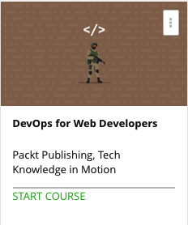

```
Roberto Nogueira  
BSd EE, MSd CE
Solution Integrator Experienced - Certified by Ericsson
```
# Udemy project



**About **

Leverage DevOps to build and deploy modern web apps efficiently.

[Homepage](https://www.udemy.com/devops-for-web-developers/)

## Topics
```
Section: 1
0 / 5
Getting Started – DevOps Concepts, Tools, and Technologies
[x] 1. The Course Overview 7:15
[x] 2. Understanding the DevOps Movement 14:46
[x] 3. The DevOps Lifecycle 16:44
[x] 4. Tools and Technologies 19:10
[x] 5. An Overview of a Sample Java EE Application 2:51

Section: 2
0 / 8
Continuous Integration with Jenkins 2
[x] 6. Installing Jenkins and the Jenkins Dashboards 6:35
[x] 7. Configuring Java & Maven in Jenkins to Build Job for Java Application with Maven 3:04
[x] 8. Configuring and Authenticating Source Code on GitHub 2:41
[x] 9. Configuring Build Job and JUnit 3:05
[x] 10. The Dashboard View Plugin – Overview and Usage 1:52
[x] 11. Managing Nodes 3:23
[x] 12. Sending E-mail Notifications Based on buildstatus 2:50
[x] 13. Integrating Jenkins and Sonar 5:52

Section: 3
0 / 4
Building the Code and Configuring the Build Pipeline
[x] 14. Creating Built-in Delivery Pipelines 5:24
[x] 15. Creating a Pipeline for Compiling and Executing Test Units 3:02
[x] 16. Using the Build Pipeline Plugin 10:27
[x] 17. Integrating the Deployment Operation 5:16

Section: 4
0 / 6
Installing and Configuring Chef
[x] 18. Getting Started with Chef 3:12
[x] 19. Overview of Hosted Chef 3:24
[x] 20. Installing and Configuring a Chef Workstation 2:49
[x] 21. Converging a Chef Node Using a Chef Workstation 3:39
[x] 22. Installing Software Packages Using Cookbooks 2:14
[x] 23. Creating a Role 4:08

Section: 5
0 / 6
Installing and Configuring Docker
[x] 24. Understanding the Difference Between Virtual Machines and Containers 6:27
[x] 25. Installing and Configuring Docker on CentOS 1:39
[x] 26. Creating Your First Docker Container 2:02
[x] 27. Understanding the Client-Server Architecture of Docker 2:31
[x] 28. Managing Containers 3:27
[x] 29. Creating a Docker Image from Docker file 5:16

Section: 6
0 / 5
Cloud Provisioning and Configuration Management with Chef
[ ] 30. Chef and Cloud Provisioning 3:59
[ ] 31. Installing Knife Plugins for Amazon Web Services and Microsoft Azure 2:52
[ ] 32. Creating and Configuring a Virtual Machine in Amazon EC2 3:54
[ ] 33. Creating and Configuring a Virtual machine in Microsoft Azure 3:23
[ ] 34. Docker Containers 3:02

Section: 7
0 / 4
Deploying an Application in AWS, Azure, and Docker
[ ] 35. Prerequisites – Deploying Our Application on a Remote Server 5:03
[ ] 36. Deploying an Application in Docker Container 1:56
[ ] 37. Deploying an Application in AWS 5:38
[ ] 38. Deploying an Application in Microsoft Azure 5:17

Section: 8
0 / 4
Monitoring Infrastructure and Applications
[ ] 39. Getting Started – Monitoring 2:34
[ ] 40. Overview of Monitoring Tools and Techniques 6:28
[ ] 41. Monitoring AWS Elastic Beanstalk 1:44
[ ] 42. Monitoring Microsoft Azure Web App Service 10:11

Section: 9
0 / 5
Orchestrating Application Deployment
[ ] 43. Creating Build Jobs for End-to-end Automation 2:42
[ ] 44. Configuring SSH Authentication Using a Key 4:15
[ ] 45. Configuring the Build Pipeline for Build Job Orchestration 7:31
[ ] 46. Executing the Pipeline for Application Deployment Automation 1:29
[ ] 47. Hygieia – a DevOps Dashboard 1:27
```
